# 服务介绍
## 用户服务
### 服务
1. 用户注册
```api
type ( // 注册
    User{
        UserId    int64  `json:"userId"`
        Phone     string `json:"phone"`
        Email     string `json:"email"`
        Password  string `json:"password"`
        NickName  string `json:"nickName"`
        Avatar    string `json:"avatar"`
        Gender    string `json:"gender"`
        BirthDate int64  `json:"birthDate"`
        Role      string `json:"role"`
        Status    int64  `json:"status"`
        CreateAt int64 `json:"createAt"`
        UpdateAt int64 `json:"updateAt"`
    }
	UserRegisterReq {
		Phone    string `json:"phone"`
		Password string `json:"password"`
		Role     string `json:"role"`
	}
	UserRegisterResp {
        User    User `json:"user"`
	}
)
```
2. 用户登录，返回token
```api
type ( // 登录
	UserLoginReq {
		Phone    string `json:"phone"`
		UserId   int64  `json:"userId"`
		Password string `json:"password"`
	}
	UserLoginResp {
		Token string `json:"token"`
	}
)
```
3. 用户修改信息
```api
type ( // 修改
    User{
        UserId    int64  `json:"userId"`
        Phone     string `json:"phone"`
        Email     string `json:"email"`
        Password  string `json:"password"`
        NickName  string `json:"nickName"`
        Avatar    string `json:"avatar"`
        Gender    string `json:"gender"`
        BirthDate int64  `json:"birthDate"`
        Role      string `json:"role"`
        Status    int64  `json:"status"`
    }
	UserUpdateReq {
		User    User `json:"user"`
	}
	UserUpdateResp  {
        User    User `json:"user"`
    }
)
```
4. 用户注销账号
```api
type ( // 删除
    User{
        UserId    int64  `json:"userId"`
        Phone     string `json:"phone"`
        Email     string `json:"email"`
        Password  string `json:"password"`
        NickName  string `json:"nickName"`
        Avatar    string `json:"avatar"`
        Gender    string `json:"gender"`
        BirthDate int64  `json:"birthDate"`
        Role      string `json:"role"`
        Status    int64  `json:"status"`
    }
	UserDeleteReq {
		Phone    string `json:"phone"` // 根据手机号删除用户
		UserId   int64  `json:"userId"`
		Password string `json:"password"`
	}
	UserDeleteResp  {
        User User   `json:"user"`
    }
)
```
5. 获取用户信息
```api
type ( // 查询
    User{
        UserId    int64  `json:"userId"`
        Phone     string `json:"phone"`
        Email     string `json:"email"`
        Password  string `json:"password"`
        NickName  string `json:"nickName"`
        Avatar    string `json:"avatar"`
        Gender    string `json:"gender"`
        BirthDate int64  `json:"birthDate"`
        Role      string `json:"role"`
        Status    int64  `json:"status"`
    }
    
	UserQueryReq {
		UserId int64 `json:"userId"` 
	}
	UserQueryResp {
		User User `json:"user"`
	}
)
```
6. 用户修改关系
```api
type (
    Relations{
        RelationsId int64 `json:"relationsId"`
        UserId int64    `json:"userId"`
        OtherId int64   `json:"otherId"`
        RelationshipType int64 `json:"relationshipType"`
        CreateAt int64       `json:"createAt"`
        UpdateAt int64       `json:"updateAt"`
    }

    UserRelationsUpdateReq{
        UserId int64 `json:"userId"`
        OUserId int64 `json:"oUserId"`
        relationshipType int64 `json:"relations"`
    }
    UserRelationsUpdateResp{
        Relations Relations    `json:"relations"`
    }
)
```
7. 用户查询关系
```api
type (
    Relations{
        RelationsId int64 `json:"relationsId"`
        UserId int64    `json:"userId"`
        OtherId int64   `json:"otherId"`
        RelationshipType int64 `json:"relationshipType"`
        CreateAt int64       `json:"createAt"`
        UpdateAt int64       `json:"updateAt"`
    }

    UserRelationsGetReq{
        UserId int64 `json:"userId"`
        OUserId int64 `json:"oUserId"`
    }
    UserRelationsGetResp{
        Relations Relations    `json:"relations"`
    }
)
```
### 数据库表
1. 用户表
```mongo
userId int64,
phone string ,
email string ,
password string,
nickName string,
avatar string,
gender int64,
birthDate int64,
role string,
status int64,
createAt int64,     
updateAt int64,    
```
2. 用户关系表
```mongo
relationsId int64,
userId int64,
otherId int64,
relationshipType int64,
createAt int64,     
updateAt int64, 
```
## 点赞服务
支持对各种实体进行点赞点踩（主题，帖子，评论），支持用户查看自己的帖子点赞记录。
### 数据库设计
根据点赞类型分库，根据baseid分表
1. 用户查看自己的点赞记录
2. 帖子的点赞点踩信息
3. 每个评论的点赞点踩信息
4. 用户点赞/点踩
## 群组服务
为了适配聊天服务的群聊机制，实现群组服务。
1. 用户创建群聊
先创建群聊，成功后在聊天服务中增加群消息，给当前用户增加用户群确认Id表
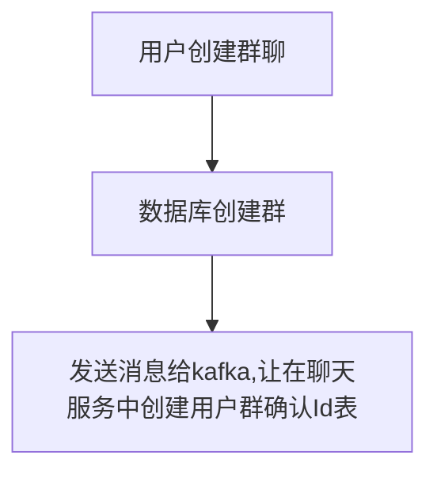
```api
type(
    GroupCreateReq{
        GroupName string `json:"groupName"`
        GroupUrl string `json:"groupUrl"`
        RootUserId int64    `json:"rootUserId"`
    }
    GroupCreateResp{
        GroupId int64 `json:"groupId"`
    }
)
```
2. 用户给群里拉/删人
先判断权限，是否是管理员，通过后在群里userId增加/删除指定用户，然后给指定用户增加用户群确认Id表/修改用户群确认ID表状态
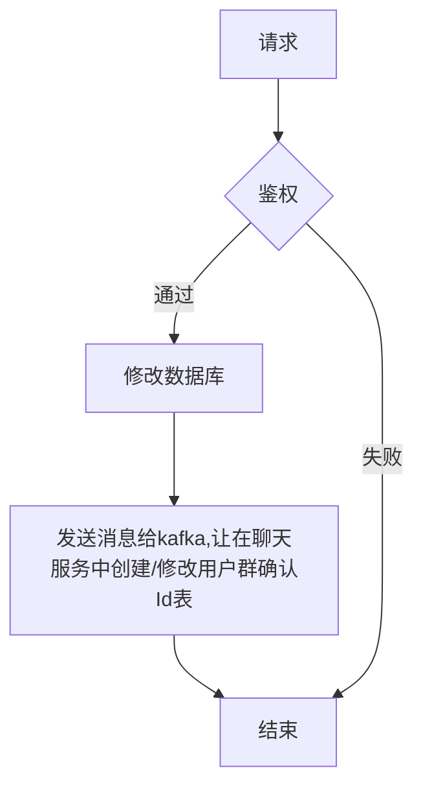
```api
type(
    GroupUserIdReq{
        UserId int64 `json:"userId"`
        AddUserId int64 `json:"addUserId"`
        GroupId int64 `json:"groupId"`
        Status int64 `json:"status"`
    }
    GroupUserIdResp{}
)
```
3. 增加/删除管理员
先判断权限，是否是群主,然后修改数据库信息
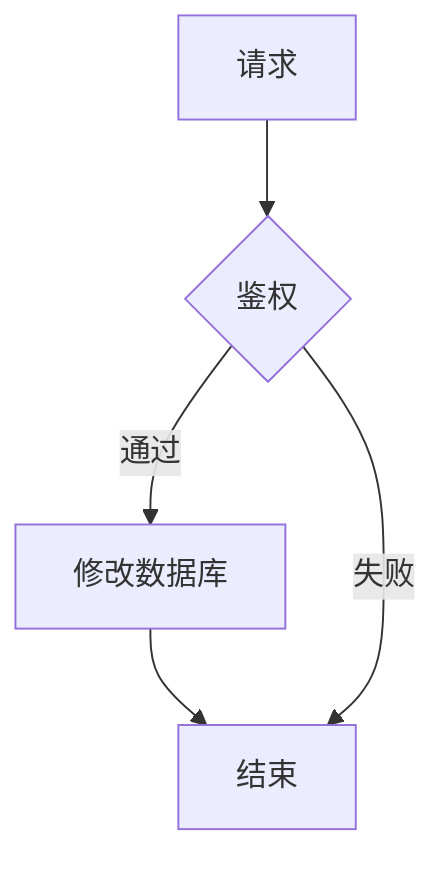
```api
type(
    GroupAdminIdReq{
        UserId int64 `json:"userId"`
        AdminId int64 `json:"addUserId"`
        GroupId int64 `json:"groupId"`
        Status int64 `json:"status"`
    }
    GroupAdminIdResp{}
)
```
4. 解散群聊
先判断权限，然后修改群状态，之后将UserId表清空，并且将每个UserID发送到kafka，修改用户确认表状态
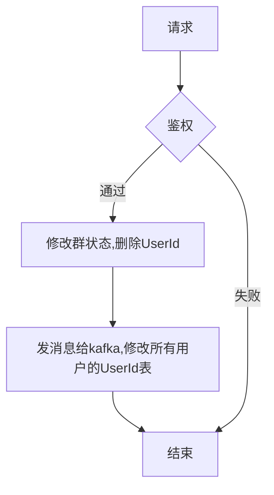
```api
type(
    GroupDeleteReq{
        UserId int64 `json:"userId"`
        GroupId int64 `json:"groupId"`
        Status int64 `json:"status"`
    }
    GroupDeleteResp{}
)
```
### 数据库
```mongo
groupId int64
groupName string
groupUrl string
rootUserId int64
mamageUserId []int64
UserId []int64
status int64
createDate int64
updateDate int64
```
## 聊天服务（hard）
因为要双端互通，所以使用websocket协议。
1. 用户上线
- 当websocket连接后，将用户信息写入redis的string，key为user:{userid}，值为空（即任意）来保证在线/下线状态，过期时间为30秒，然后在websocket连接过程中，每10秒自动刷新一次redis过期时间。
- 数据库获取信息，查找未确认的用户消息和群消息，推送给用户。
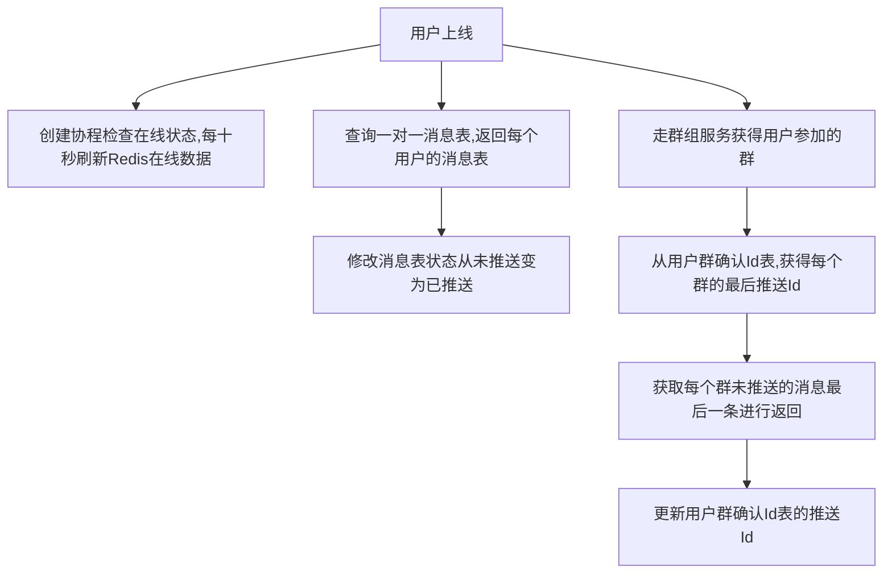
```api
type (
    Message{
        GroupId int64 `json:"groupId"`
        MessageId int64 `json:"messageId"`
        FromUserId int64 `json:"fromUserId"`
        ToUserId int64  `json:"toUserId"`
        Text int64  `json:"text"`
        CreateDate int64 `json:"createDate"`
    }
)
type (
    MessageReciveReq{//上拉刷新使用
        MessageId int64 `json:"messageId"`
        UserId int64 `json:"userId"`
        Limit int64   `json:"limit"`
    }
    MessageReciveResp{
        Message map[int64][]Message `json:"message"`
    }
)

```
2. 查看用户是否上下线
- 当websocket连接后，将用户信息写入redis的string，key为user:{userid}，值为空（即任意）来保证在线/下线状态，过期时间为30秒，然后在websocket连接过程中，每10秒自动刷新一次redis过期时间。
- 当redis数据消息时，则认为用户下线。
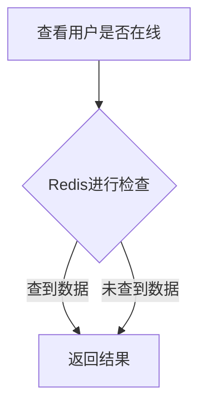
```api
type(
    UserOnlineStatusCheckReq{
        UserId int64  `json:"userId"`
    }
    UserOnlineStatusCheckResp{
        UserId int64  `json:"userId"`
        IsOnline int64  `json:"IsOnline"`
    }
)
```
3. 一对一发送消息
- 检测权限（同步请求用户服务，是否是朋友关系，某一方状态是否正常，如果不是，统计信息，如果对方没有回复则只能发送三条），如果并发发送了100条消息怎么办？？？
- 检测通过后生成唯一ID，然后将消息发到kafka，然后返回。
- 聊天服务处理kafka消息，然后将消息存到数据库，状态为未确认，然后检查用户是否在线，如果在线将消息进行推送。
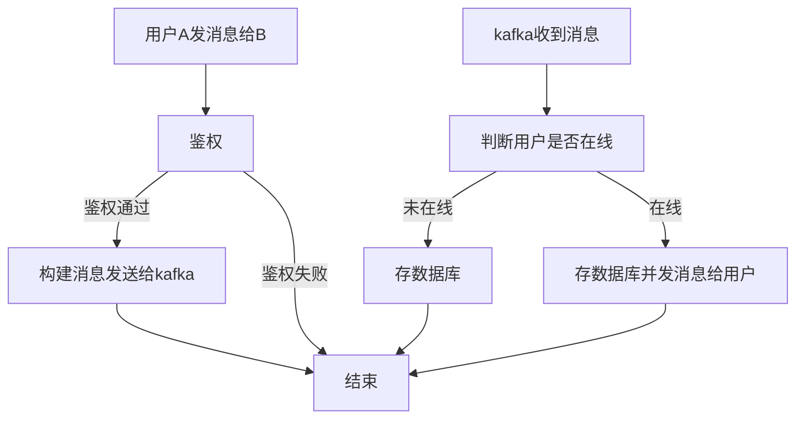
```api
type (
    Message{
        MessageId int64 `json:"messageId"`
        FromUserId int64 `json:"fromUserId"`
        ToUserId int64  `json:"toUserId"`
        Text int64  `json:"text"`
        CreateDate int64 `json:"createDate"`
    }
)
type (
    MessageSendReq{
        Message Message `json:"message"`
    }
)
type (
    MessageReciveReq{//
        UserId int64 `json:"userId"`
    }
    MessageReciveResp{
        Message []Message `json:"message"`
    }
)
```
4. 用户确认一对一消息
当用户点开聊天页面后，或者处于聊天页面收到服务器发送的数据时，前端就会将对应用户最新的MessageId发送过来以更新数据库状态
- 修改指定用户消息的MessageId前所有Id的确认状态，全部修改为已确认。
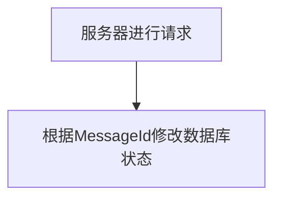
```api
type(
    Message{
        MessageId int64 `json:"messageId"`
        FromUserId int64 `json:"fromUserId"`
        ToUserId int64  `json:"toUserId"`
        Text int64  `json:"text"`
        CreateDate int64 `json:"createDate"`
    }
)
type (
    MessageAckReq{
        MessageId int64 `json:"messageId"`
        FromUserId int64 `json:"fromUserId"`
        ToUserId int64 `json:"toUserId"`
    }
    MessageAckResp{//服务器并不返回此数据
        MessageId int64    `json:"messageId"`
    }
)
```
5. 一对多发送消息（群聊发送）
- 用户发送消息到指定群聊，为防止服务前期过于复杂，群聊消息不进行验证，生成分布式唯一Id后直接发送kafka，然后返回。
- 从kafka收到消息后将数据写到群消息数据库，然后遍历群成员，获取在线状态并进行消息推送。
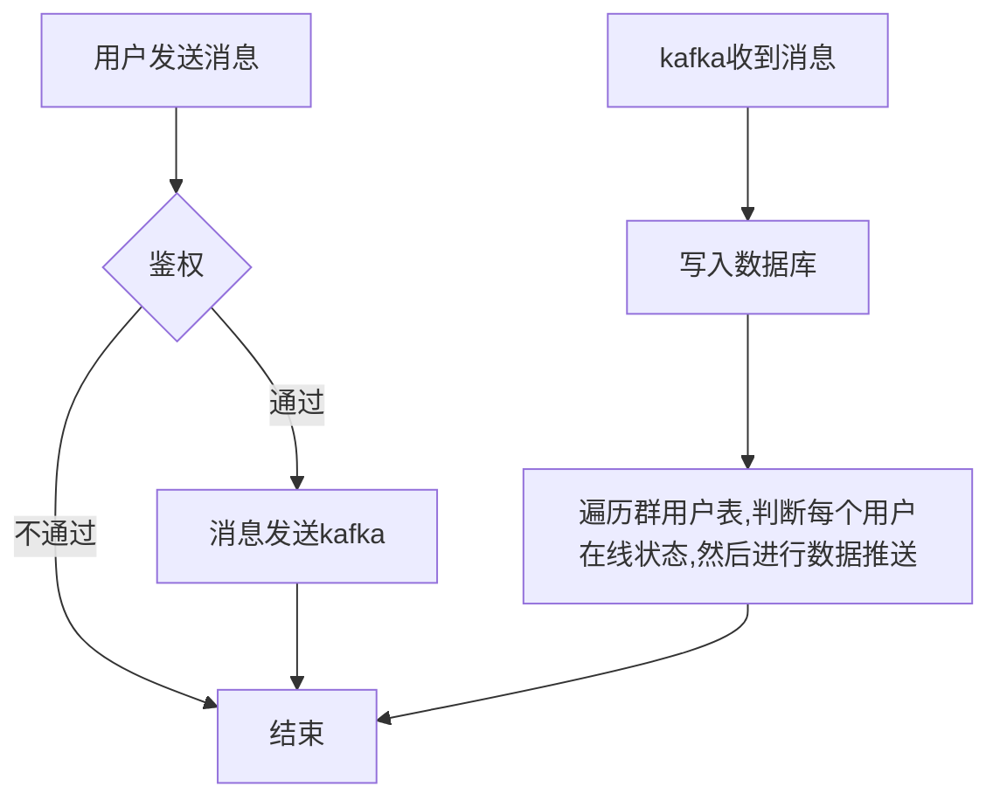
```api
type(
    Message{
        GroupId int64 `json:"groupId"`
        MessageId int64 `json:"messageId"`
        FromUserId int64 `json:"fromUserId"`
        Text int64  `json:"text"`
        CreateDate int64 `json:"createDate"`
    }
    MessageSendGruopReq{
        GroupMessage Message `json:"groupMessage"`
    }
)
```
6. 群消息接受
- 当用户点开聊天页面后，或者处于聊天页面并且收到服务器数据时，前端就会将对应用户最新的MessageId发送过来以更新数据库状态
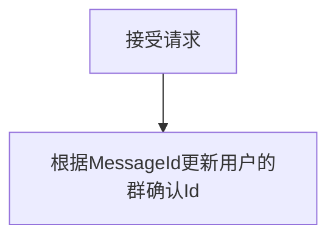
```api
type(
    GroupMessage{
        GroupId int64 `json:"groupId"`
        MessageId int64 `json:"messageId"`
        FromUserId int64 `json:"fromUserId"`
        Text int64  `json:"text"`
        CreateDate int64 `json:"createDate"`
    }
    MessageAckGruopReq{
        GroupMessage GroupMessage `json:"groupMessage"`
        UserId int64 `json:"userId"`
        GroupId int64 `json:"groupId"`
    }
)
```
7. 给指定用户创建群消息确认Id表
- 当收到请求时，判断用户是否已经有此表，如果有则状态更新，或者直接返回，如果没有则创建新文档，并且判断用户在线状态，确定是否推送。
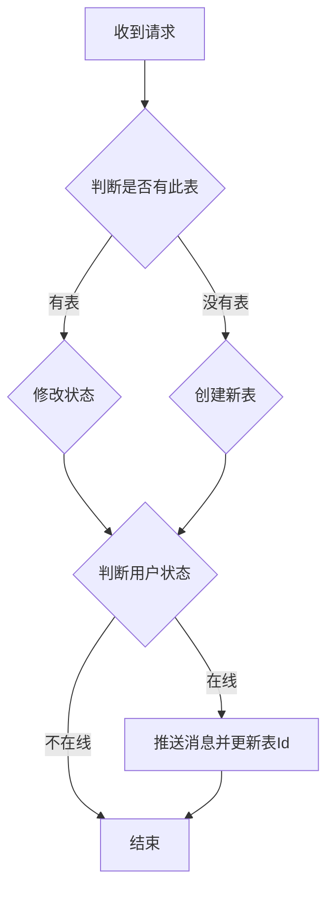
```api
type(
    GroupCreateGroupAckIdReq{
        userId int64 `json:"userId"`
        GroupId int64 `json:"groupId"`
    }
)
```
### 数据库表定义
1. 一对一消息表
```mongodb
messageId int64
fromUserId int64 
toUserId int64  
text int64  
createDate int64
status int64//已确认，已推送，未推送
```
2. 群消息表
```mongodb
groupId int64 
messageId int64 
fromUserId int64 
text int64  
createDate int64 
```
3. 用户群确认Id表
```mongodb
status int64//是否在群里
groupId int64
userId int64
messageSendId int64//群消息已推送Id
messageReciveId int64//群消息已确认Id
```
### 缓存表
```redis
string:
    key:user:{userid} 
    cal:nil
```
## 影评服务
1. 用户查看指定ID的评论
- 从Redis中进行加载，Redis类型为sorted set类型，key为baseId，source为权重（正点赞数*-100+评论时间到现在的时间戳分钟数目），过期时间一分钟
- 数据读取后如果一级评论展示则直接返回指定offset和limit。如果多级展示（对应端上展开功能）则展示对应baseId的Redis列表，返回指定offset和limit。
- 查询过程中如果没有找到指定baseId的数据，则去数据库进行查询，将所有查询的数据计算分数并存到Redis的sorted set中，key为baseId，然后返回。如果没有查找则redis设置对应sorted set的key，值为空，过期时间两秒钟，防止缓存穿透。
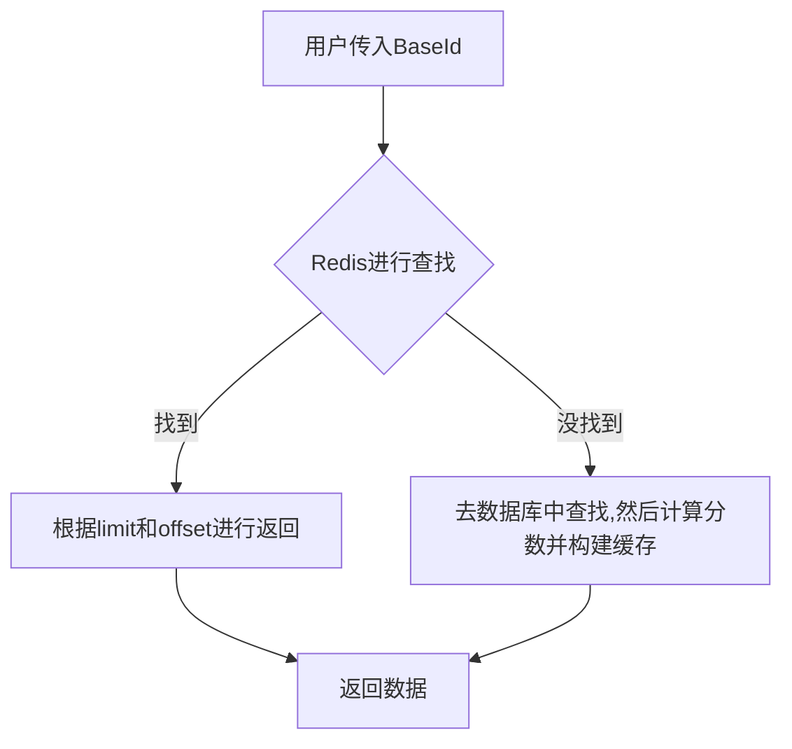
```api
type(
    ReviewData{
        ReviewId int64   `json:"reviewId"`
        BaseId int64    `json:"baseId"`
        Text string     `json:"text"`
        UserId int64 `json:"userId"`
        LikeCount int64 `json:"likeCount"`
        DislikeCount int64 `json:"dislikeCount"`
        CreateDate int64 `json:"createDate""`
        UpdateDate int64 `json:"updateDate"`
        RootId int64 `json:"rootId"`
        Status int64   `json:"status"`
        Level int64 `json:"level"`
        SubCommentCount int64 `json:"subCommentCount"`
        RootSubCommentCount int64 `json:"rootSubCommentCount"`
    }
)
type(
    ReviewQueryReq{
        BaseId int64 `json:"baseId"`
        Limit int64 `json:"limit"`
        Offset int64 `json:"offset"`
        format int64 `json:"format"`
    }
    ReviewQueryResp{
        ReviewData []ReviewData  `json:reviewData"`
        Count int64 `json:"count"`
    }
)
```
2. 用户给指定ID点赞/点踩
- 用户传入后先构建主键进行数据库查找，如果没有找到创建事务{插入数据库，然后更新baseId的数据，并且删除Redis的缓存以更新数据}。
- 如果找到了则判断状态，如果状态不变则什么都不修改，如果状态变了则创建事务{更新数据库，然后更新baseId的数据，并且删除Redis的缓存以更新数据}。
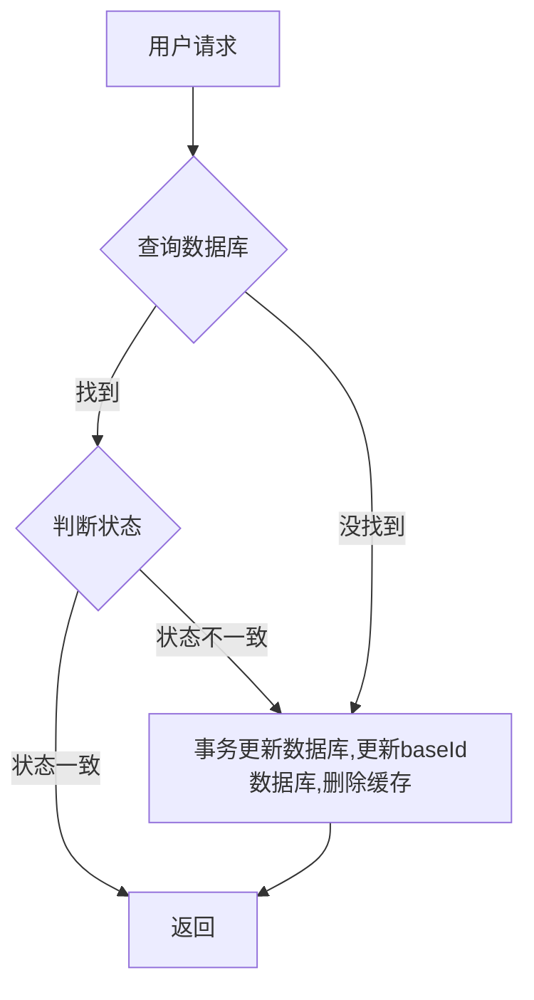
```api
type(
    ReviewVoteReq{
        UserId int64 `json:"userId"`
        BaseId int64 `json:"baseId"`
        Status int64 `json:"status"`
    }
    ReviewVoteResp{
        OperationId int64 `json:"operationId"`
    }
)
```
3. 用户给指定ID进行评论
创建新的ReviewId，发kafka给文本检测服务，并发更新数据库，此时状态是未鉴定，修改数据库后直接返回，前端直接给当前用户显示，然后等待消息队列将数据返回回来，如果没问题，则修改状态并且删除缓存，如果异常则修改状态返回给用户评论违规，已经被删除。
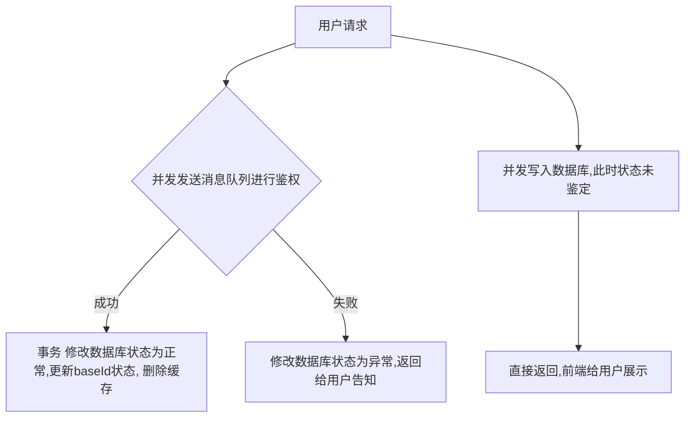
```api
type(
    ReviewCreateReq{
        BaseId int64 `json:"baseId"`
        UserID int64 `json:"userId"`
        Text string `json:"text"`
    }
    ReviewCreateResp{
        ReviewId int64 `json:"reviewId"`
    }
)
```
4. 删除评论
先用户身份鉴权，通过后递归删除评论和用户点赞点踩表，然后更新数据库删除缓存。
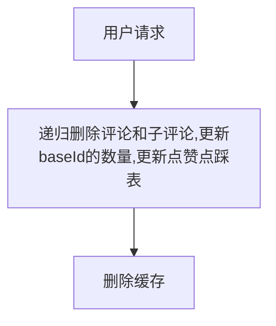
```api
type(
    ReviewDeleteReq{
        ReviewId int64 `json:"reviewId"`
        BaseId int64 `json:"baseId"`
        UserID int64 `json:"userId"`
    }
    ReviewDeleteResp{
        ReviewId int64 `json:"reviewId"`
    }
)
```
### 数据库表
1. 评论数据表(mongo)
```mongo
reviewId int64(主键)//评论ID
userId int64//用户ID
baseId int64//被评论事物ID
rootId int64//跟评论的Id
path int64//路径，快速删除时使用
text string//评论的文本信息
status int64//当前状态（正常，被删除）
likeCount int64//被点赞总数
dislikeCount int64//被点踩总数
level int64//评论级别（对帖子的评论为1级，对评论的评论为2级，继续评论级数继续增加）
subCommentCount int64//子评论数量
rootSubCommentCount int64//根节点的隶属节点数量
createDate int64//创建时间
updataDate int64//修改时间
```
2. 用户点赞点踩表(mongo)
```mongo
operationId int64(主键)//操作ID(userId+reviewId)
userId int64//用户ID
reviewId int64//评论ID
status int64//状态（点赞，点踩）
createDate int64//创建时间
updataDate int64//修改时间
```
### 缓存表
```redis
sorted set
    BaseId:[source,element]...//存储BaseId的子评论信息
```
## 话题服务

## 电影信息服务
1. 查看电影信息
用户数据请求先同步推荐系统，获得指定的一批MovieInformationId，在Redis的String获得对应的电信信息，没有获取到则读mongo获得，回写Redis。
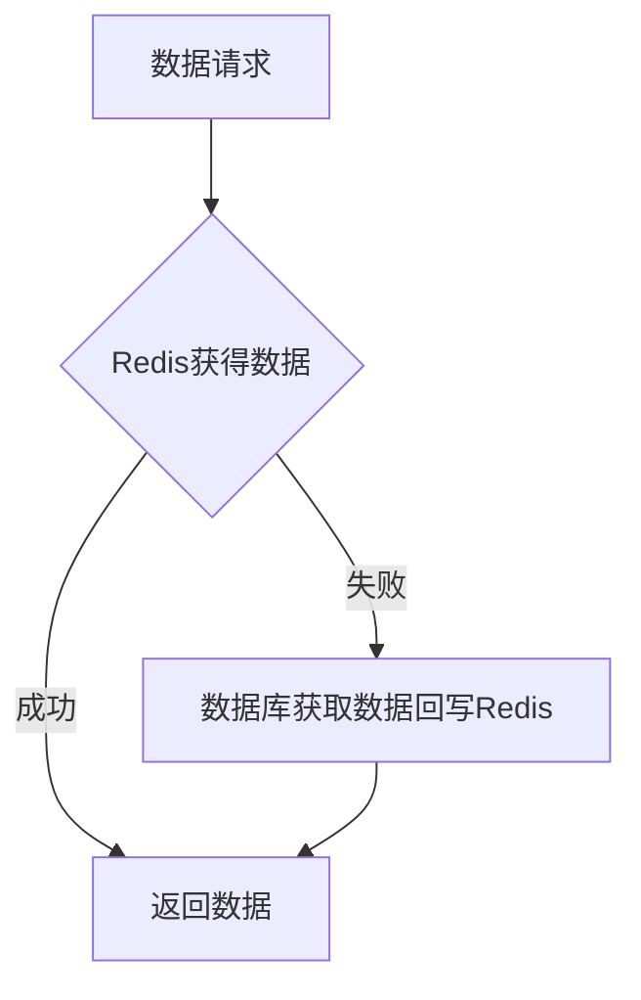
```api
type (
    MovieInformation {
        MovieInformationId int64    `json:"movieInformationId"` //电影id
        Title              string   `json:"title"` // 电影的标题，通常是电影的主要名称
        Desc               string   `json:"desc"` // 电影的简短描述或简介，用于概述电影内容
        Author             string   `json:"author"` // 电影的作者或创作团队，可能指编剧、导演等
        Actors             []string `json:"actors"` // 电影的主要演员名单，以字符串数组形式存储
        Language           string   `json:"language"` // 电影的语言，如中文、英语等
        Duration           int      `json:"duration"` // 电影的时长，通常以分钟为单位
        ReleaseDate        string   `json:"release_date"` // 电影的上映日期，格式通常为“YYYY-MM-DD”
        Genre              []string `json:"genre"` // 电影的类型或分类，如“喜剧”“科幻”“动作”等，以字符串数组存储
        Poster             string   `json:"poster"` // 电影海报的图片链接，用于展示电影的视觉信息
    }
)
type (
    MovielnInformationReq {
        UserId    int64                  `json:"userId"` // 用户ID
        SortField string                 `json:"sortField"` // 排序字段，如 "popularity", "recency", "rating" 等
        SortOrder string                 `json:"sortOrder"` // 排序顺序，"asc" 表示升序，"desc" 表示降序
        Limit     int                    `json:"limit"` // 返回的记录数量限制
        Offset    int64                  `json:"offset"` // 分页偏移量
        Keywords  string                 `json:"keywords"` // 搜索关键词
        Filters   map[string]interface{} `json:"filters"` // 过滤条件
        Language  string                 `json:"language"` // 请求的语言偏好
        Region    string                 `json:"region"` // 请求的地区偏好
    }
    MovieInfomationResp {
        MovieInformation []MovieInformation `json:"movieInformations"`
    }
)
```
2. 电影信息创建
此处提供创建电影信息的接口，然后离线脚本通过爬虫来获得豆瓣等平台的电影信息并且写入，不回写Redis，等待推荐系统返回然后来获取时回写。
数据请求异步走审核系统，审核通过后写入数据库。
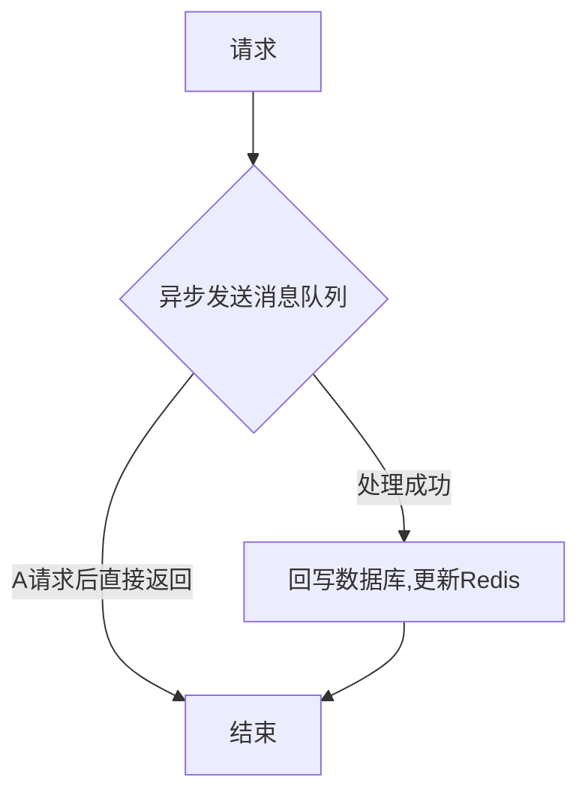
```api
type (
    MovieInformation {
        MovieInformationId int64    `json:"movieInformationId"` //电影id
        Title              string   `json:"title"` // 电影的标题，通常是电影的主要名称
        Desc               string   `json:"desc"` // 电影的简短描述或简介，用于概述电影内容
        Author             string   `json:"author"` // 电影的作者或创作团队，可能指编剧、导演等
        Actors             []string `json:"actors"` // 电影的主要演员名单，以字符串数组形式存储
        Language           string   `json:"language"` // 电影的语言，如中文、英语等
        Duration           int      `json:"duration"` // 电影的时长，通常以分钟为单位
        ReleaseDate        string   `json:"release_date"` // 电影的上映日期，格式通常为“YYYY-MM-DD”
        Genre              []string `json:"genre"` // 电影的类型或分类，如“喜剧”“科幻”“动作”等，以字符串数组存储
        Poster             string   `json:"poster"` // 电影海报的图片链接，用于展示电影的视觉信息
    }
)
type (
    MovielnCreateReq {
        MovieInformation []MovieInformation `json:"movieInformations"`
    }
    MovieCreateResp {
        MovieInformationId []int64 `json:"movieInformationIds"`
    }
)
```
## 数据库表
1. 电影信息表
```mongo
movieInformationId int64     //电影id
title              string   // 电影的标题，通常是电影的主要名称
desc               string    // 电影的简短描述或简介，用于概述电影内容
author             string    // 电影的作者或创作团队，可能指编剧、导演等
actors             []string // 电影的主要演员名单，以字符串数组形式存储
language           string   // 电影的语言，如中文、英语等
duration           int       // 电影的时长，通常以分钟为单位
releaseDate        string    // 电影的上映日期，格式通常为“YYYY-MM-DD”
genre              []string  // 电影的类型或分类，如“喜剧”“科幻”“动作”等，以字符串数组存储
poster             string   // 电影海报的图片链接，用于展示电影的视觉信息
createDate int64//创建时间
updateDate int64//更新时间
```
## 缓存表
1. Redis string，key为movie:{id}，值为对应数据。
## 审核服务

# 帖子信息
```mongo
postId         int64     // 帖子ID，唯一标识一条帖子
userId         int64     // 发布帖子的用户ID
movieId        int64     // 所属的电影ID（关联 movieInformationId）
title          string    // 帖子标题，用于总结帖子的主要内容
content        string    // 帖子正文，包含用户的评价、讨论或感想
images         []string  // 帖子配图，存储图片URL数组（可选）
tags           []string  // 帖子标签，用于分类，如“剧透”“影评”“推荐”
likeCount      int       // 点赞数
commentCount   int       // 评论数（方便快速展示）
createDate     int64     // 创建时间（Unix 时间戳）
updateDate     int64     // 更新时间（Unix 时间戳）

```