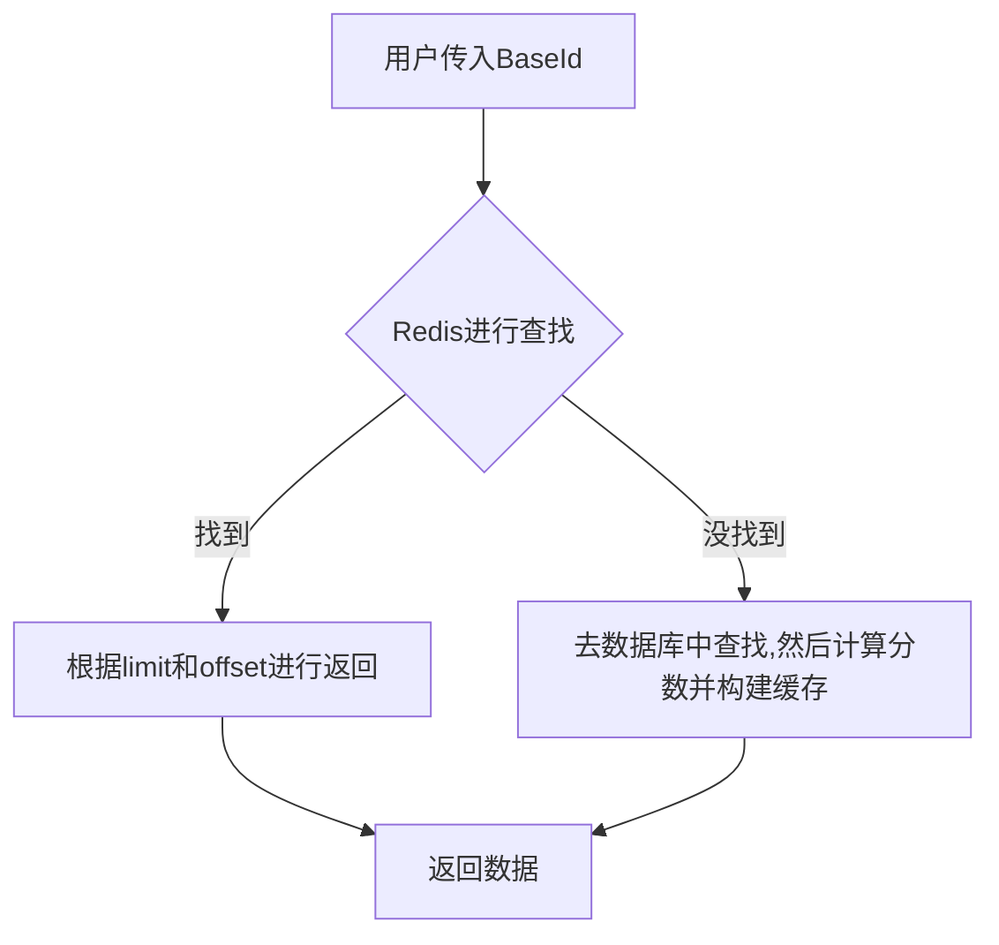
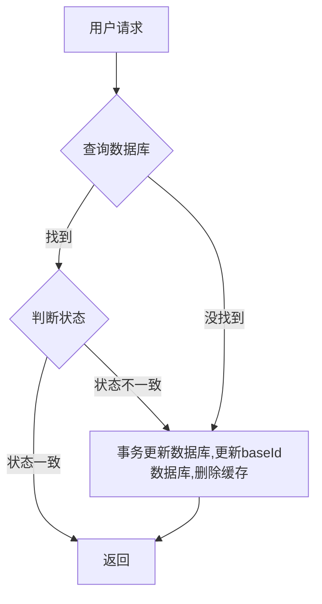
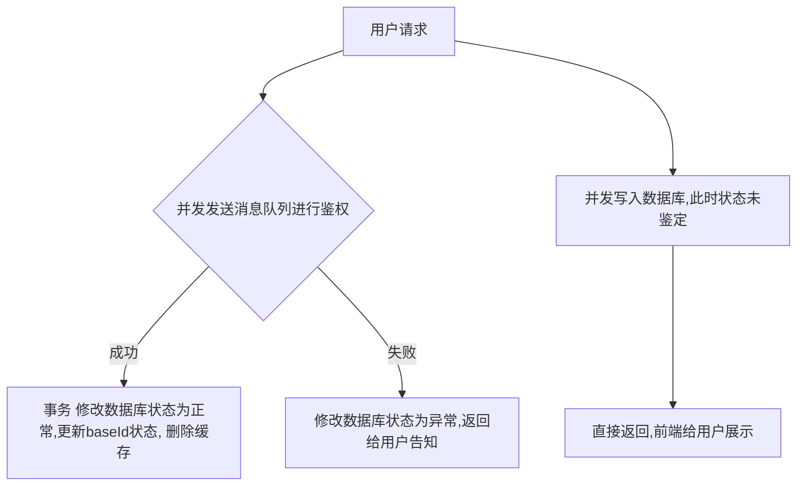
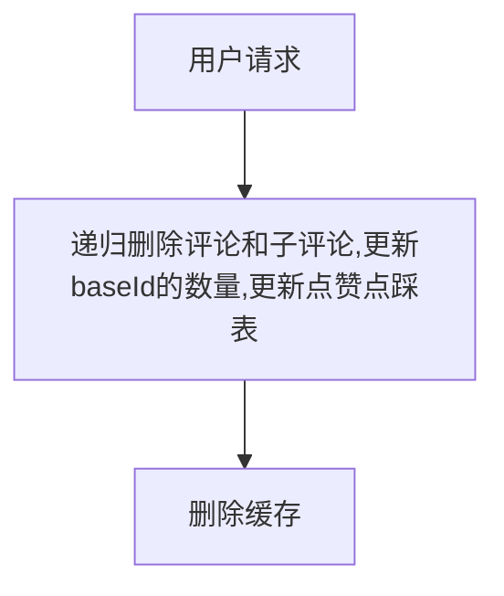

## 影评服务
1. 用户查看指定ID的评论
- 从Redis中进行加载，Redis类型为sorted set类型，key为baseId，source为权重（正点赞数*-100+评论时间到现在的时间戳分钟数目），过期时间一分钟
- 数据读取后如果一级评论展示则直接返回指定offset和limit。如果多级展示（对应端上展开功能）则展示对应baseId的Redis列表，返回指定offset和limit。
- 查询过程中如果没有找到指定baseId的数据，则去数据库进行查询，将所有查询的数据计算分数并存到Redis的sorted set中，key为baseId，然后返回。如果没有查找则redis设置对应sorted set的key，值为空，过期时间两秒钟，防止缓存穿透。

```api
type(
    ReviewData{
        ReviewId int64   `json:"reviewId"`
        BaseId int64    `json:"baseId"`
        Text string     `json:"text"`
        UserId int64 `json:"userId"`
        LikeCount int64 `json:"likeCount"`
        DislikeCount int64 `json:"dislikeCount"`
        CreateDate int64 `json:"createDate""`
        UpdateDate int64 `json:"updateDate"`
        RootId int64 `json:"rootId"`
        Status int64   `json:"status"`
        Level int64 `json:"level"`
        SubCommentCount int64 `json:"subCommentCount"`
        RootSubCommentCount int64 `json:"rootSubCommentCount"`
    }
)
type(
    ReviewQueryReq{
        BaseId int64 `json:"baseId"`
        Limit int64 `json:"limit"`
        Offset int64 `json:"offset"`
        format int64 `json:"format"`
    }
    ReviewQueryResp{
        ReviewData []ReviewData  `json:reviewData"`
        Count int64 `json:"count"`
    }
)
```
2. 用户给指定ID点赞/点踩
- 用户传入后先构建主键进行数据库查找，如果没有找到创建事务{插入数据库，然后更新baseId的数据，并且删除Redis的缓存以更新数据}。
- 如果找到了则判断状态，如果状态不变则什么都不修改，如果状态变了则创建事务{更新数据库，然后更新baseId的数据，并且删除Redis的缓存以更新数据}。

```api
type(
    ReviewVoteReq{
        UserId int64 `json:"userId"`
        BaseId int64 `json:"baseId"`
        Status int64 `json:"status"`
    }
    ReviewVoteResp{
        OperationId int64 `json:"operationId"`
    }
)
```
3. 用户给指定ID进行评论
   创建新的ReviewId，发kafka给文本检测服务，并发更新数据库，此时状态是未鉴定，修改数据库后直接返回，前端直接给当前用户显示，然后等待消息队列将数据返回回来，如果没问题，则修改状态并且删除缓存，如果异常则修改状态返回给用户评论违规，已经被删除。

```api
type(
    ReviewCreateReq{
        BaseId int64 `json:"baseId"`
        UserID int64 `json:"userId"`
        Text string `json:"text"`
    }
    ReviewCreateResp{
        ReviewId int64 `json:"reviewId"`
    }
)
```
4. 删除评论
   先用户身份鉴权，通过后递归删除评论和用户点赞点踩表，然后更新数据库删除缓存。

```api
type(
    ReviewDeleteReq{
        ReviewId int64 `json:"reviewId"`
        BaseId int64 `json:"baseId"`
        UserID int64 `json:"userId"`
    }
    ReviewDeleteResp{
        ReviewId int64 `json:"reviewId"`
    }
)
```
### 数据库表
1. 评论数据表(mongo)
```mongo
reviewId int64(主键)//评论ID
userId int64//用户ID
baseId int64//被评论事物ID
rootId int64//跟评论的Id
path int64//路径，快速删除时使用
text string//评论的文本信息
status int64//当前状态（正常，被删除）
likeCount int64//被点赞总数
dislikeCount int64//被点踩总数
level int64//评论级别（对帖子的评论为1级，对评论的评论为2级，继续评论级数继续增加）
subCommentCount int64//子评论数量
rootSubCommentCount int64//根节点的隶属节点数量
createDate int64//创建时间
updataDate int64//修改时间
```
2. 用户点赞点踩表(mongo)
```mongo
operationId int64(主键)//操作ID(userId+reviewId)
userId int64//用户ID
reviewId int64//评论ID
status int64//状态（点赞，点踩）
createDate int64//创建时间
updataDate int64//修改时间
```